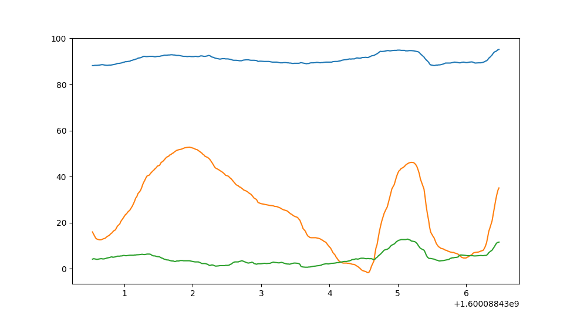

# Smartphone Connector

This simple package exposes methods to interact with smartphones connected to a [socket.io server](https://github.com/lebalz/socketio_server) instance.

## Examples

[All examples and scripts on GitHub](https://github.com/lebalz/smartphone-connector/blob/master/examples/)

### Draw 3x3 checker board

```py
from smartphone_connector import Connector
phone = Connector('https://io.lebalz.ch', 'FooBar')

# draw a 3x3 checker board
phone.set_grid([
    ['black','white','black'],
    ['white','black','white'],
    ['black','white','black']
], broadcast=True)

# print the letter A
phone.set_grid([
  [9,9,9,9],
  [9,0,0,9],
  [9,9,9,9],
  [9,0,0,9],
  [9,0,0,9],
])
```

results on all devices in the following screen.

When `broadcast` is set to `False` (default), only the `FooBar` devices display the checker board.


### Stream & display gyroscope data

```py
from smartphone_connector import Connector, GyroMsg
import matplotlib.pyplot as plt
phone = Connector('https://io.lebalz.ch', 'FooBar')
MAX_SAMPLES = 300

y = []
x = []
plt.show()


def on_gyro(data: GyroMsg):
    if len(x) > MAX_SAMPLES:
        x.pop(0)
        y.pop(0)

    x.append(data.time_stamp)
    y.append([data.alpha, data.beta, data.gamma])


def on_intervall():
    plt.clf()
    plt.plot(x, y)
    plt.pause(0.01)


phone.on_gyro = on_gyro
phone.subscribe(on_intervall, interval=0)
```

Displays gyroscope data from the smartphone on a Matplotlib-Plot.


## Package and upload to pip

@see [this tutorial](https://packaging.python.org/tutorials/packaging-projects/)

```sh
rm -rf build/ dist/ smartphone_connector.egg-info/ && \
python3 setup.py sdist bdist_wheel && \
python3 -m twine upload dist/*
```
