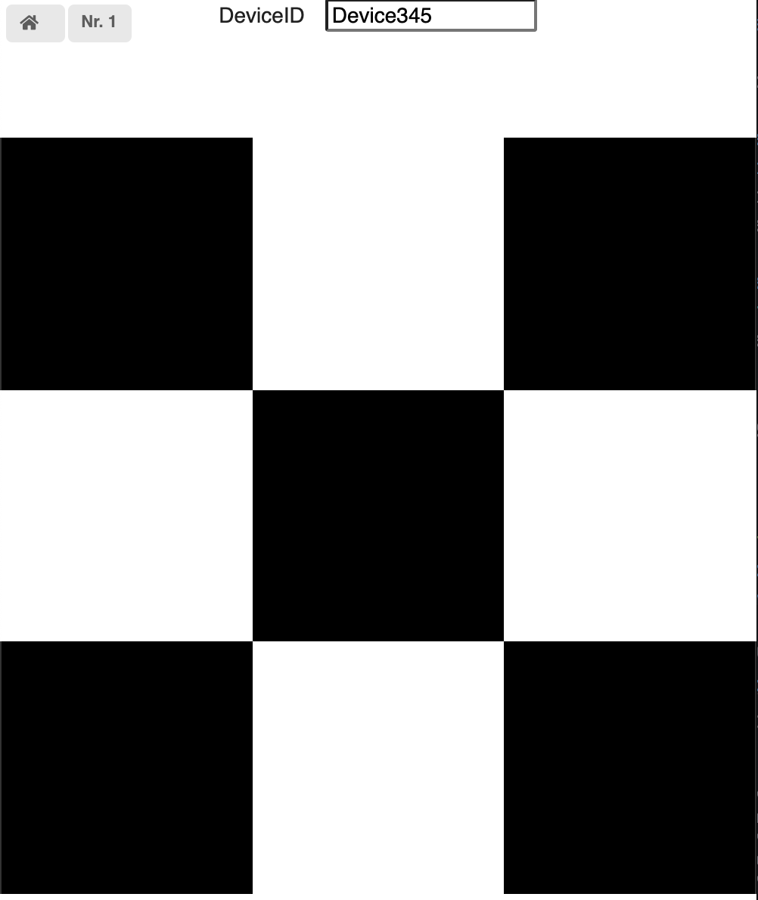
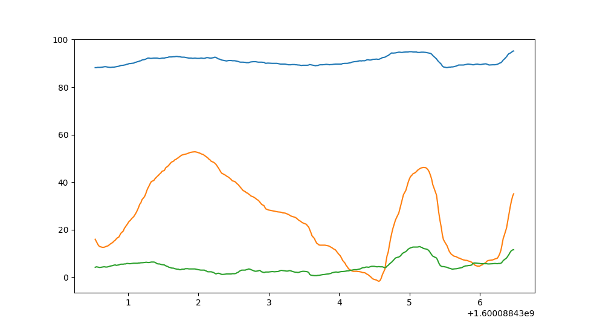

# Smartphone Connector

This simple package exposes methods to interact with smartphones connected to a [socket.io server](https://github.com/lebalz/socketio_server) instance.

## Socket Server

This package talks with a socket.io server, which defines the following events and actions.

A simple socket io server implementing this interface can be seen on [github.com/lebalz/socketio_server](https://github.com/lebalz/socketio_server). A running server is currently (August 2020) deployed under [io.lebalz.ch](https://io.lebalz.ch).

### Events

- `device`
  ```py
  {
    'device_id': str,
    'is_client': bool,
    'device_nr': int,
    'socket_id': str
  }
  ```
- `devices`
  ```
  [
    {
        'device_id': str,
        'is_client': bool,
        'device_nr': int,
        'socket_id': str
    },
    ...
  ]
  ```
- `all_data`
  ```
  [
    {
      'acceleration': [
        {
          'device_id': str,
          'time_stamp': int, # time (seconds) since client loaded page,
          ...
        },
        ...
      ],
      'gyro': [
        {
          ...
        }
      ]
    },
    ...
  ]
  ```
- `new_data`
  ```
  {
    'device_id': str,
    'device_nr': int,
    'time_stamp': int, # time (seconds) since client loaded page,
    'type': DataType
    ...
  }
  ```
- `room_joined`
  ```
  {
    'device_id': str,
    'is_client': bool,
    'device_nr': int,
    'socket_id': str
  }
  ```
- `room_left`
  ```
  {
    'device_id': str,
    'is_client': bool,
    'device_nr': int,
    'socket_id': str
  }
  ```
- `error_msg`
  ```
  {
    'msg': str,
    'err': dict | str
  }
  ```

### Actions (for emitting)

- `emit('clear_data', { 'device_id': str })`
- `emit('new_device', { 'device_id': str })`
- `emit('get_all_data', { 'device_id': str })`
- `emit('get_devices', { 'device_id': str })`
- `emit('new_data', { 'device_id': str, time_stamp: int, ... })`
- `emit('new_data', { 'device_nr': int, time_stamp: int, ... })`
- `emit('join_room', { 'room': str })`
- `emit('leave_room', { 'room': str })`

### Callbacks (when fired when event is received)

when a function is assigned to one of the following props, this function will be called with the received data as its first argument and optionally with the Connector instance as the second argument.

- `on_key`
- `on_pointer`
- `on_acceleration`
- `on_gyro`
- `on_sensor`
- `on_data`
- `on_broadcast_data`
- `on_all_data`
- `on_device`
- `on_devices`
- `on_error`
- `on_room_joined`
- `on_room_left`
- `on_client_device` - when a webbrowser client with the same `device_id` connects (the client device is passed) or disconnects (`None` is passed)
- `on_sprite_out`
- `on_sprite_collision`
- `on_border_overlap`

e.g.

```py
phone = Connector('https://io.lebalz.ch')
phone.on_key = lambda data: print('on key', data)
phone.on_key = lambda data, conn: print('on key', data, 'data pakages', len(conn.all_data()))
```

will print each received key

## Helpers

To convert the time_stamps (seconds since epoch) to a python `time_stamp` object, the function `to_datetime` may be used.

To get a random color (e.g. for the color panel), you can call `random_color()` and get a random rgb color.

## Class ´Controller`

### Attributes

Normally the user is responsible to keep track of sent and received messages. For convenienc, the last `5` received data messages (and for streamed sensor values the last `120` Messages what is around 2s of data) are kept in memory. When recording is turned on, all messages are stored... This can use a lot of memory and shall be used with care...

Start recording: `device.start_recording()` (this cleans the current data first)
Stop recording: `device.stop_recording()`

- `data` data dictionary. key: `device_id`, value: List containing all data messages
- `data_list` flattend list containing all received messages
- `devices` all devices
- `device` the connected device (self)
- `server_url` the connected server. (readonly)
- `device_id` the device_id connected to. (readonly)
- `sio` the raw socket io client
- `room_members` list of devices and scripts connected to this room
- `joined_rooms` all rooms which this client gets events from
- `device_count` the count of all devices and scripts currently connected to the server
- `client_count` the count of client devices connected over a webbrowser to the server (e.g. Smartphones)
- `room_member_count` count of other clients/scripts connected to this room. All these clients will receive the events of this room too.
- `client_device` the first found device connected over a webbrowser with the same `device_id`
- `client_devices` all devices connected over a webbrowser to the server
- `get_grid` returns the last sent grid
- `sprites` returns all sent sprites

## Methods

- `emit(event, data={}, broadcast=False, unicast_to=None)`
  - `event`: name of the emitted event
  - `data`: whatever data you want to send
  - `broadcast`: when set to true, the event is broadcasted to all currently connected devices. Defaults to `False`
  - `unicast_to`: the message is sent exclusively to the device with the specified number. Has precedence over the `boradcast` option.
- `send(data={}, broadcast=False, unicast_to=None)`
  - `data`: whatever data you want to send
  - `broadcast`: when set to true, the event is broadcasted to all currently connected devices. Defaults to `False`
  - `unicast_to`: the message is sent exclusively to the device with the specified number. Has precedence over the `boradcast` option.
- `prompt(question, input_type: 'text' | 'number' | 'datetime' | 'date'| 'time' | 'select' = 'text')` prompts the user with the given question (str). The input type is used to set the correct html type of the input field.
- `input(question, input_type: 'text' | 'number' | 'datetime' | 'date'| 'time' | 'select' = 'text')` prompts the user with the given question (str). The input type is used to set the correct html type of the input field.
- `select(question, options: List[str])` prompts the user to select a value from the list
- `print(message: str, display_time: float = -1, alert: bool = False, broadcast: bool = False, unicast_to: int = None)`
  - `message` the notification message
  - `display_time` time in seconds to show the notification
  - `alert` wheter the user must confirm the notification. If yes, this is a blocking call.
- `notify(message: str, display_time: float = -1, alert: bool = False, broadcast: bool = False, unicast_to: int = None)`
  - `message` the notification message
  - `display_time` time in seconds to show the notification
  - `alert` wheter the user must confirm the notification. If yes, this is a blocking call.
- `alert(self, message: str, unicast_to: int = None)` alert the user and wait until he confirms the message.
- `broadcast(data: {type: str})` broadcast's a `new_data` event. The data must contain the field `type`.
  e.g.

  ```py
  phone.broadcast({'type': 'grid', 'grid': ['red']})
  phone.broadcast({'type': 'color', 'color': 'red'})
  ```

- `unicast_to(data: {'type': str}, device_nr: int)` unicast's a `new_data` event to the specified device. The data must contain at least the field `type`.
  e.g.

  ```py
  phone.unicast({'type': 'grid', 'grid': ['red']}, 2)
  phone.unicast({'type': 'color', 'color': 'red'}, 1)
  ```

- `subscribe_async(callback, interval)` notifys the subscriber after each interval with the current dataframe without blocking the main thread.
- `subscribe(callback, interval, blocking=True)` notifys the subscriber after each interval with the current dataframe.
- `cancel_subscription()` cancels the subscription of data frames
- `clear_data()` clears all data on the server related to this `device_id``
- `all_broadcast_data(data_type: str = None) -> List[DataMsg]` returns all broadcasted data of the given type. When no type is provided, all broadcasted data is returned.
- `latest_broadcast_data(data_type: str = None) -> DataMsg | None` returns the latest received data of the given type. None is returned when no data is present.
- `all_data(data_type: str = None, device_id: str = None) -> List[DataMsg]` returns all data with the given type and from the given device_id.
- `latest_data(data_type: str = None, device_id: str = None) -> DataMsg | None` returns the latest data (last received) with the given type and from the given device_id.
- `set_grid(grid, device_id: str = None, device_nr: int = None, broadcast: bool = False)` sends a `new_data` event with the given grid. the grid can be either a `1D` or `2D` array containing css colors.
- `set_grid_at(row: int, column: int, color: str | int | rgb | rgba)` sets the color at the given position. The same props are used as on the last set_grid call (base_color etc...).
- `set_image(image, device_id: str = None, device_nr: int = None, broadcast: bool = False)` sends a string image to the phone. Transforms the provided image to a grid and uses internally `set_grid`. So subsequent calls to `set_grid_at` are valid.
  ```py
  image = [
      '9  9 9999 9     9     99999',
      '9  9 9    9     9     9   9',
      '9999 9999 9     9     9   9',
      '9  9 9    9     9     9   9',
      '9  9 9999 99999 99999 99999'
  ]
  phone.set_image(image)
  ```
- `set_color(color: str, device_id: str = None, device_nr: int = None, broadcast: bool = False)` sets the color of the color panel
- `disconnect()`
- `sleep(seconds=0)`
- `wait()`
- `clean_data()` removes all gathered data
- `join_room(device_id: str)` joins the room of another device. This means that all events from this other device will be streamed to this client too.
- `leave_room(device_id: str)` leaves the room of this device. This means no events from this device are received.
- `pointer_data(device_id = '__ALL_DEVICES__')`
- `color_pointer_data(device_id = '__ALL_DEVICES__')`
- `grid_pointer_data(device_id = '__ALL_DEVICES__')`
- `gyro_data(device_id = '__ALL_DEVICES__')`
- `acceleration_data(device_id = '__ALL_DEVICES__')`
- `key_data(device_id = '__ALL_DEVICES__')`
- `latest_pointer(device_id = '__ALL_DEVICES__')`
- `latest_color_pointer(device_id = '__ALL_DEVICES__')`
- `latest_grid_pointer(device_id = '__ALL_DEVICES__')`
- `latest_gyro(device_id = '__ALL_DEVICES__')`
- `latest_acceleration(device_id = '__ALL_DEVICES__')`
- `latest_key(device_id = '__ALL_DEVICES__')`
- `set_device_nr(new_device_nr: int, device_id: str = None, current_device_nr: int = None, max_wait: float = 5)`
- `configure_playground(width: int, height: int, shift_x: int, shift_y: int, color: str)`
  The default origin is in the bottom left corner and all sprites will be placed realtive to the origin. The origin can be shifted by adding an offset to the coordinates. To shift the to the right, a negative `x_shift` must be applied.
  e.g. for a playground in 4:3 with the origin in center:
  ```py
  device.configure_playground(
    width=400,
    height=300,
    shift_x=-200,
    shift_y=-150
  )
  ```
- `clear_playground()` removes all sprites from the playground
- `add_sprite()`
- `update_sprite()`
- `remove_sprite(sprite_id: str)`
- ```py
  with add_sprites() as add:
    add(id='sprite_1', color='red')
    add(id='sprite_2', color='blue')
  ```
- ```py
  with update_sprites() as update:
    update(id='sprite_1', color='green')
    update(id='sprite_2', color='green')
  ```

## Examples

### Draw 3x3 checker board

```py
from smartphone_connector import Connector
phone = Connector('https://io.lebalz.ch', 'FooBar')

# draw a 3x3 checker board
phone.set_grid([
    ['black','white','black'],
    ['white','black','white'],
    ['black','white','black']
], broadcast=True)

# print the letter A
phone.set_grid([
  [9,9,9,9],
  [9,0,0,9],
  [9,9,9,9],
  [9,0,0,9],
  [9,0,0,9],
])
```

results on all devices in the following screen.

When `broadcast` is set to `False` (default), only the `FooBar` devices display the checker board.



### Stream & display gyroscope data

```py
from smartphone_connector import Connector, GyroMsg
import matplotlib.pyplot as plt
phone = Connector('https://io.lebalz.ch', 'FooBar')
MAX_SAMPLES = 300

y = []
x = []
plt.show()


def on_gyro(data: GyroMsg):
    if len(x) > MAX_SAMPLES:
        x.pop(0)
        y.pop(0)

    x.append(data.time_stamp)
    y.append([data.alpha, data.beta, data.gamma])


def on_intervall():
    plt.clf()
    plt.plot(x, y)
    plt.pause(0.01)


phone.on_gyro = on_gyro
phone.subscribe(on_intervall, interval=0)
```

Displays gyroscope data from the smartphone on a Matplotlib-Plot.


## Package and upload to pip

@see [this tutorial](https://packaging.python.org/tutorials/packaging-projects/)

```sh
rm -rf build/ dist/ smartphone_connector.egg-info/ && \
python3 setup.py sdist bdist_wheel && \
python3 -m twine upload dist/*
```
