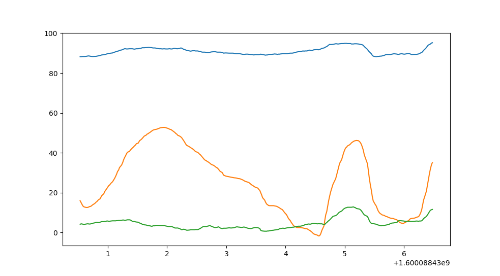

# Examples

### Eratosthenes Sieve

[Script Eratosthenes Sieve](grid_eratosthenes_sieve.py)


### Draw 3x3 checker board

```py
from smartphone_connector import Connector
device = Connector('https://io.lebalz.ch', 'FooBar')

# draw a 3x3 checker board
device.set_grid([
    ['black','white','black'],
    ['white','black','white'],
    ['black','white','black']
], broadcast=True)

device.sleep(1)
# print the letter A
device.set_grid([
  [9,9,9,9],
  [9,0,0,9],
  [9,9,9,9],
  [9,0,0,9],
  [9,0,0,9],
])
device.disconnect()
```


### Stream & display gyroscope data

[Script for acceleration plot](./acc_plot.py)

```py
from smartphone_connector import Connector, GyroMsg
import matplotlib.pyplot as plt
device = Connector('https://io.lebalz.ch', 'FooBar')
MAX_SAMPLES = 300

y = []
x = []
plt.show()


def on_gyro(data: GyroMsg):
    if len(x) > MAX_SAMPLES:
        x.pop(0)
        y.pop(0)

    x.append(data.time_stamp)
    y.append([data.alpha, data.beta, data.gamma])


def on_intervall():
    plt.clf()
    plt.plot(x, y)
    plt.pause(0.01)


device.on_gyro = on_gyro
device.subscribe(on_intervall, interval=0)
```

Displays gyroscope data from the smartphone on a Matplotlib-Plot.

